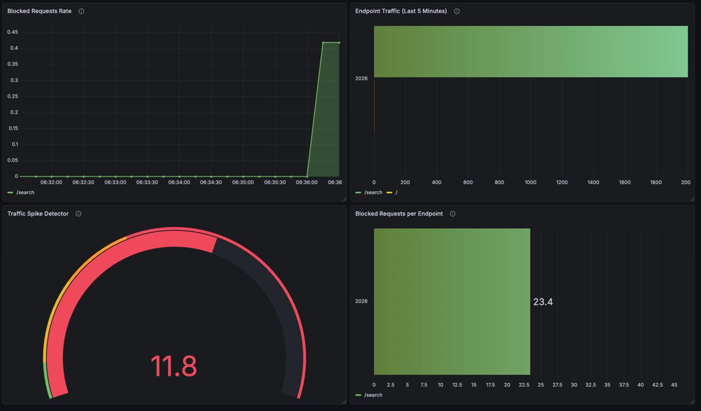
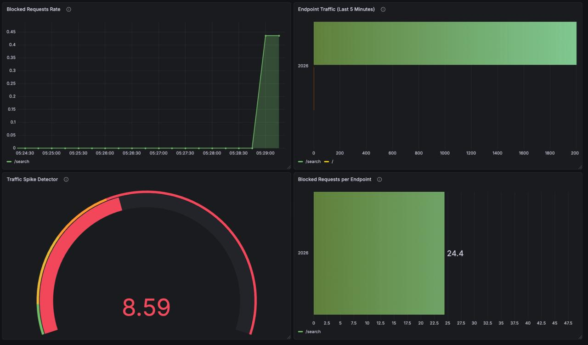
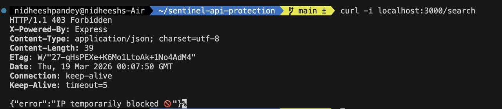
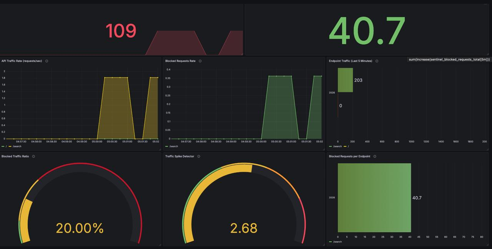

# Sentinel API Protection

A **distributed API protection system** built with **Node.js, Redis, Prometheus, and Grafana**.

Sentinel protects backend APIs from abusive clients by implementing:

- distributed rate limiting
- traffic spike detection
- IP reputation scoring
- real-time monitoring dashboards

The system detects abnormal traffic patterns and automatically blocks malicious clients while exposing observability metrics for monitoring.

---

## Key Capabilities

• Distributed Rate Limiting  
• Real-Time Traffic Monitoring  
• Attack Detection  
• Automated IP Blocking  
• Prometheus Metrics Export  
• Grafana Security Dashboard  

---

## Example Attack Flow

Sentinel uses a layered API protection architecture.

```

             Client Requests
                    │
                    ▼
           Node.js API Gateway
                    │
                    ▼
           Rate Limiting Layer
        ┌────────────┼────────────┐
        │            │            │
   Token Bucket   Sliding Window   Reputation Check
        │
        ▼
      Redis
(distributed state storage)
        │
        ▼
 Prometheus Metrics Exporter
        │
        ▼
      Prometheus
        │
        ▼
     Grafana Dashboard

```


This architecture allows Sentinel to:

- block malicious traffic
- detect spikes
- expose real-time metrics
- scale across distributed systems

---

# Tech Stack

| Component | Purpose |
|---|---|
| Node.js | API server |
| Redis | distributed rate limiting storage |
| Prometheus | metrics collection |
| Grafana | monitoring dashboard |
| Docker | containerized deployment |

---

# Project Structure

```

sentinel-api-protection
│
├── src
│ ├── config
│ │ └── rateLimits.js
│ │
│ ├── logger.js
│ ├── metrics.js
│ ├── rateLimiter.js
│ ├── redisClient.js
│ ├── reputation.js
│ ├── slidingWindow.js
│ ├── tokenBucket.js
│ └── server.js
│
├── monitoring
│ ├── prometheus
│ │ └── prometheus.yml
│ │
│ └── grafana
│ ├── dashboards
│ │ └── sentinel-dashboard.json
│ │
│ └── alerts
│ └── alerts.yaml
│
├── docker-compose.yml
├── Dockerfile
├── package.json
└── README.md

```
---

# How Sentinel Stops Attacks

Sentinel uses a multi-layer defense strategy.

1️⃣ **Traffic Spike Detection**

Prometheus monitors request volume and detects sudden traffic spikes.

2️⃣ **Rate Limiting**

If a client sends too many requests within a short window, the rate limiter blocks excess traffic.

3️⃣ **Reputation System**

Repeated violations increase the client's reputation score.

When the score exceeds the threshold, the IP is automatically banned.

4️⃣ **Permanent Blocking**

Banned clients receive:

HTTP 403 Forbidden

and cannot access the API until the block expires.

# Running the Project

## Clone repository

```

git clone https://github.com/YOUR_USERNAME/sentinel-api-protection.git

cd sentinel-api-protection

```

---

## Start services

```

docker compose up --build

```

This launches:

- Node API
- Redis
- Prometheus
- Grafana

---

# Access Services

| Service | URL |
|---|---|
| API | http://localhost:3000 |
| Prometheus | http://localhost:9090 |
| Grafana | http://localhost:3001 |

---

# API Endpoints

| Endpoint | Description |
|---|---|
| `/search` | Example protected endpoint |
| `/metrics` | Prometheus metrics endpoint |

---

# Attack Simulation

You can simulate high-traffic scenarios.

## Normal Traffic

```
for i in {1..100}; do curl http://localhost:3000/search ; done

```


Expected behaviour:

- requests allowed
- no blocking

---

## Attack Simulation

```
seq 2000 | xargs -P100 -I{} curl http://localhost:3000/search

```

Expected behaviour:

- rate limiter activates
- requests blocked
- metrics recorded

---

# Attack Demonstration

The following screenshots show Sentinel detecting and blocking a simulated API attack.

---

## 1️⃣ Traffic Spike Detection

When a large number of requests are sent in a short time window, Sentinel detects abnormal traffic spikes.



The **Traffic Spike Detector** compares short-term traffic against long-term averages.

If the ratio exceeds the threshold, it indicates abnormal traffic.

---

## 2️⃣ Rate Limiter Blocking Requests

Once the request threshold is exceeded, the rate limiter starts blocking requests.



The dashboard shows:

• increasing blocked requests  
• endpoint receiving malicious traffic  
• spike detection triggering

---

## 3️⃣ Reputation System Banning IP

Repeated violations increase the IP reputation score.

When the score exceeds the allowed limit, the IP is banned.

Banned clients receive the following response:

```http
HTTP/1.1 403 Forbidden
Content-Type: application/json

{"error":"IP temporarily blocked 🚫"}
```




This ensures persistent attackers cannot continue sending requests.

# Monitoring Dashboard

Sentinel exposes Prometheus metrics that are visualized using a Grafana security dashboard.

The dashboard provides real-time visibility into API traffic.

### Dashboard Overview



The dashboard tracks:

• Total API requests  
• Blocked requests  
• Requests per second  
• Traffic spike detection  
• Blocked traffic ratio  
• Endpoint attack distribution


# Summary

Sentinel demonstrates how modern API protection systems work.

It combines:

• distributed rate limiting  
• reputation-based banning  
• traffic spike detection  
• real-time observability

This architecture is similar to protections used by API gateways and edge security platforms.

# Future Improvements

Possible enhancements:

- distributed rate limiting across multiple API nodes
- automated threat scoring
- anomaly detection with machine learning
- alerting via Slack / PagerDuty
- integration with API gateway

---

# License

MIT License
